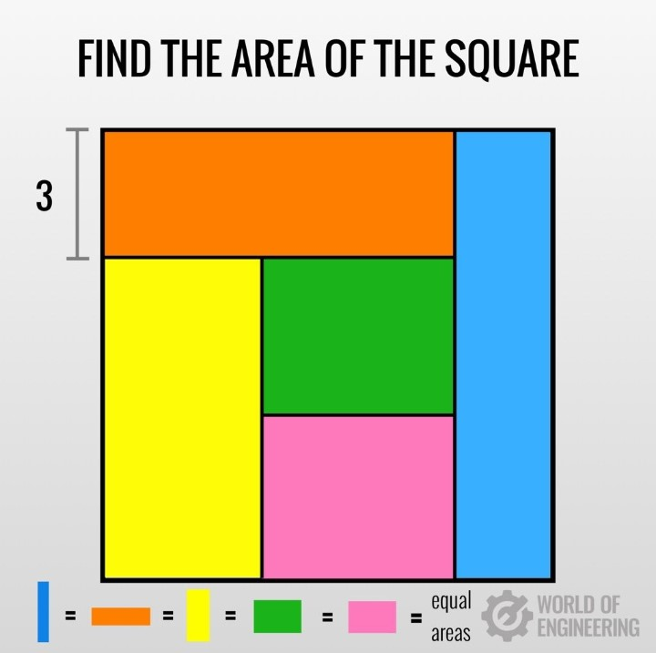

# squarish-mystery

**Visualisation of a Mathematical Puzzle using p5.js**

This interactive sketch explores a geometric mystery: a square composed of **five rectangles**, each with **equal area**, and one with a known width of `3`. Can you determine the area of the whole square?

Spoiler: the answer is **12 × 12 = 144**, but discovering why is the fun part. By adjusting the width of the key rectangle, you can reshape the configuration—watch the puzzle come alive as everything adapts while maintaining equal areas.

## 🔄 Interaction

- **Click** on a rectangle to select it.
- Use **arrow keys** to **stretch** or **compress** the selected tile.
- The layout dynamically adjusts to preserve equal area among rectangles.

## 🧠 What's the Mystery?

This sketch is based on a deceptively simple-looking geometry problem. It’s not just about numbers—it’s about how area, proportion, and layout interplay when a constraint is enforced (equal area in this case).

## 🚀 Getting Started

1. Download or clone the repository.
2. Open `index.html` in your browser.
3. Play with the configuration and uncover the mystery!

## 🛠️ Built With

- [p5.js](https://p5js.org/) — JavaScript library for creative coding.

## 📷 Credits

Puzzle Image: *World of Engineering*  
Simulation: *Usman (p5.js implementation)*

---

**Explore. Stretch. Solve.**  
Welcome to the `squarish-mystery`.
